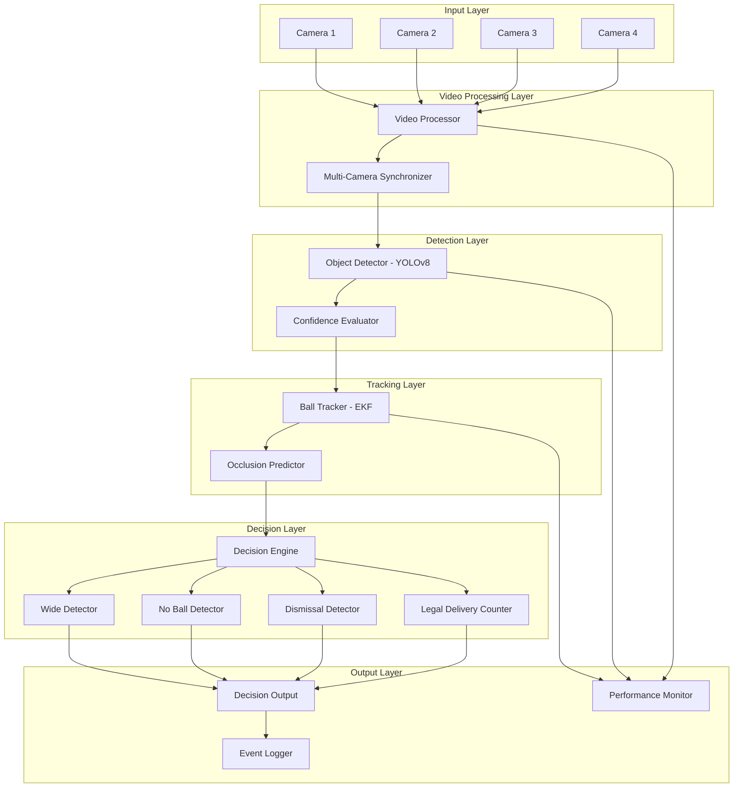

# Design Document: AI Auto-Umpiring System

## Overview

The UmpirAI system is a real-time computer vision application that automates cricket umpiring decisions by analyzing live video feeds. The system processes video at 30+ frames per second, detects cricket elements (ball, stumps, players, crease lines), tracks ball trajectory, and applies cricket rules to generate umpiring decisions for wide balls, no balls, dismissals (bowled, caught, LBW), and over completion.

### Key Design Principles

1. **Real-time Performance**: Process video at minimum 30 FPS with decision latency under 1 second
2. **Modular Architecture**: Separate concerns for video capture, detection, tracking, and decision logic
3. **Accuracy First**: Prioritize detection accuracy over speed; flag uncertain decisions for manual review
4. **Multi-camera Fusion**: Support up to 2 synchronized camera angles for improved accuracy
5. **Graceful Degradation**: Continue operation with reduced confidence when components fail

### Technology Stack

- **Object Detection**: YOLOv8 (based on research showing 99.5% mAP50 for pitch detection and 99.18% mAP50 for ball detection in cricket scenarios)
- **Ball Tracking**: Extended Kalman Filter (EKF) with occlusion prediction
- **Video Processing**: OpenCV for frame capture and preprocessing
- **Multi-camera Sync**: Cross-view object motion alignment with millisecond accuracy
- **Decision Engine**: Rule-based system implementing ICC cricket laws , truff laws

## Architecture

### System Architecture Diagram



### Data Flow

1. **Video Capture**: Cameras capture frames → Video Processor buffers and preprocesses
2. **Synchronization**: Multi-camera frames aligned by timestamp within 50ms
3. **Detection**: YOLOv8 identifies ball, stumps, players, crease lines in each frame
4. **Confidence Evaluation**: Detection confidence scores evaluated; low confidence flagged
5. **Tracking**: EKF tracks ball position across frames, predicts during occlusion
6. **Decision Making**: Rule engine analyzes trajectory and positions to classify events
7. **Output Generation**: Decisions formatted as text/audio and logged with video references

## Components and Interfaces

### 1. Video Processor

**Responsibility**: Capture and preprocess video frames from multiple camera sources

**Interface**:
```python
class VideoProcessor:
    def add_camera_source(self, camera_id: str, source: CameraSource) -> None
    def start_capture(self) -> None
    def stop_capture(self) -> None
    def get_frame(self, camera_id: str) -> Frame
    def get_synchronized_frames(self) -> Dict[str, Frame]
    def adjust_exposure(self, camera_id: str, lighting_change: float) -> None
    def get_frame_rate(self) -> float
```

**Key Features**:
- Supports smartphone cameras (via RTSP/HTTP streaming) and external cameras (USB/HDMI capture)
- Maintains 30+ FPS capture rate
- Automatic exposure adjustment for lighting changes (±30% threshold)
- Frame buffering for synchronization (circular buffer, 2-second capacity)
- Graceful handling of camera disconnection with reconnection attempts

**Implementation Details**:
- Uses OpenCV `VideoCapture` for frame acquisition
- Separate thread per camera source to prevent blocking
- Frame timestamps captured at acquisition time using system monotonic clock
- Preprocessing: resize to 1280x720, normalize pixel values, apply gamma correction if needed

### 2. Multi-Camera Synchronizer

**Responsibility**: Align frames from multiple cameras to the same temporal reference

**Interface**:
```python
class MultiCameraSynchronizer:
    def add_camera(self, camera_id: str, intrinsics: CameraIntrinsics) -> None
    def synchronize_frames(self, frames: Dict[str, Frame]) -> SynchronizedFrameSet
    def estimate_temporal_offset(self, cam1_id: str, cam2_id: str) -> float
    def get_sync_quality(self) -> float
```

**Key Features**:
- Cross-view object motion alignment (based on ball trajectory across views)
- Millisecond-accurate synchronization (target: <50ms offset)
- Automatic temporal offset estimation using ball motion as reference
- Handles variable frame rates across cameras

**Algorithm** (based on VisualSync approach):
1. Detect ball position in each camera view
2. Compute epipolar constraints for ball motion across views
3. Optimize temporal offsets to minimize epipolar constraint violations
4. Apply offsets to align frame timestamps
5. Interpolate frames if necessary to achieve exact alignment

### 3. Object Detector

**Responsibility**: Identify cricket elements in video frames using deep learning

**Interface**:
```python
class ObjectDetector:
    def detect(self, frame: Frame) -> DetectionResult
    def detect_multi_view(self, frames: SynchronizedFrameSet) -> MultiViewDetectionResult
    def get_model_version(self) -> str
    def update_model(self, model_path: str) -> None
```

**Detection Classes**:
- Ball (class 0)
- Stumps (class 1)
- Crease line (class 2)
- Batsman (class 3)
- Bowler (class 4)
- Fielder (class 5)
- Pitch boundary (class 6)
- Wide guideline (class 7)

**Model Architecture**: YOLOv8m (medium variant)
- Input: 1280x720 RGB frames
- Output: Bounding boxes + confidence scores + class labels
- Target accuracy: 90%+ for ball, 95%+ for stumps/crease, 85%+ for players

**Confidence Thresholds**:
- High confidence: ≥90% (use directly)
- Medium confidence: 70-90% (use with caution, flag for review)
- Low confidence: <70% (flag as uncertain, may trigger multi-view fusion)

**Multi-view Fusion**:
- When multiple cameras detect same object, average bounding box positions weighted by confidence
- Triangulate 3D ball position from 2+ camera views using camera calibration
- Use view with highest confidence when views conflict significantly

### 4. Ball Tracker

**Responsibility**: Track ball position across frames and predict trajectory during occlusion

**Interface**:
```python
class BallTracker:
    def update(self, detection: BallDetection, timestamp: float) -> TrackState
    def predict(self, timestamp: float) -> PredictedPosition
    def get_trajectory(self) -> List[Position3D]
    def get_velocity(self) -> Vector3D
    def is_occluded(self) -> bool
    def reset(self) -> None
```

**Tracking Algorithm**: Extended Kalman Filter (EKF)

**State Vector** (9 dimensions):
- Position: (x, y, z) in meters relative to pitch center
- Velocity: (vx, vy, vz) in m/s
- Acceleration: (ax, ay, az) in m/s² (models gravity and air resistance)

**Process Model**:
```
x(t+1) = x(t) + vx(t)*dt + 0.5*ax(t)*dt²
y(t+1) = y(t) + vy(t)*dt + 0.5*ay(t)*dt²
z(t+1) = z(t) + vz(t)*dt + 0.5*az(t)*dt² - 0.5*g*dt²  (gravity)
vx(t+1) = vx(t) + ax(t)*dt
vy(t+1) = vy(t) + ay(t)*dt
vz(t+1) = vz(t) + az(t)*dt - g*dt
ax(t+1) = ax(t) * drag_coefficient
ay(t+1) = ay(t) * drag_coefficient
az(t+1) = az(t) * drag_coefficient
```

**Measurement Model**:
- Observations: 2D pixel coordinates (u, v) from camera(s)
- Convert to 3D using camera calibration and ground plane assumption
- Measurement noise: σ = 5 pixels (based on detection uncertainty)

**Occlusion Handling**:
- Track occlusion duration (frame count without detection)
- If occluded ≤10 frames (~333ms at 30 FPS): use EKF prediction
- If occluded >10 frames: flag decision as uncertain
- Resume tracking when ball reappears (match predicted position to detection)

**Trajectory Calculation**:
- Store last 30 positions (1 second of history at 30 FPS)
- Calculate speed: ||velocity vector|| in m/s
- Determine path relative to pitch boundaries using calibrated pitch model

### 5. Decision Engine

**Responsibility**: Apply cricket rules to classify match events

**Interface**:
```python
class DecisionEngine:
    def process_frame(self, detections: DetectionResult, track: TrackState) -> Decision
    def classify_delivery(self, trajectory: Trajectory, context: MatchContext) -> DeliveryType
    def calculate_confidence(self, decision: Decision) -> float
    def get_match_state(self) -> MatchState
```

**Sub-components**:

#### 5.1 Wide Ball Detector

**Logic**:
1. Identify batsman stance position from detection
2. Define wide guidelines: ±1.0m from batsman center (adjustable based on stance)
3. Track ball path as it crosses batsman's crease line
4. If ball crosses outside guidelines: classify as WIDE
5. Adjust guidelines if batsman moves significantly (>0.5m from original stance)

**Confidence Factors**:
- Ball detection confidence at crossing point
- Batsman position detection confidence
- Guideline calibration quality

#### 5.2 No Ball Detector

**Logic**:
1. Detect bowler's front foot position at ball release
2. Measure distance from front foot to crease line
3. If any part of foot is beyond crease line: classify as NO_BALL
4. Ball release detected by: sudden velocity change in ball trajectory

**Confidence Factors**:
- Foot position detection confidence
- Crease line detection confidence
- Occlusion status at release moment

#### 5.3 Dismissal Detector

**Bowled Detection**:
1. Detect ball-stump contact: ball bounding box intersects stump bounding box
2. Verify bail dislodgement: change in stump region appearance (bail position change)
3. Verify ball contacted stumps before any other object (check trajectory history)
4. If all conditions met: classify as BOWLED

**Caught Detection**:
1. Detect ball-bat contact: ball trajectory changes direction near bat
2. Track ball to fielder: ball enters fielder bounding box
3. Verify fielder control: ball remains in fielder box for ≥3 frames
4. Verify no ground contact: ball height >0.1m throughout flight to fielder
5. If all conditions met: classify as CAUGHT

**LBW Detection**:
1. Detect ball-pad contact: ball trajectory intersects batsman leg region
2. Check pitching point: ball must pitch in line with stumps or outside off stump
3. Check impact point: contact must be in line with stumps
4. Project trajectory: extend ball path to stumps using physics model
5. If trajectory intersects stump region: recommend LBW
6. Provide visualization: overlay projected path on video

**Confidence Factors**:
- Detection confidence at key moments (contact, catch, etc.)
- Trajectory prediction uncertainty
- Occlusion during critical events

#### 5.4 Legal Delivery Counter

**Logic**:
1. For each delivery, check: NOT wide AND NOT no ball
2. If legal: increment counter
3. If counter reaches 6: signal OVER_COMPLETE
4. Reset counter after over completion
5. Track deliveries per over for match statistics

### 6. Decision Output

**Responsibility**: Format and present decisions to users

**Interface**:
```python
class DecisionOutput:
    def display_decision(self, decision: Decision) -> None
    def announce_decision(self, decision: Decision) -> None
    def get_output_format(self) -> OutputFormat
    def set_output_format(self, format: OutputFormat) -> None
```

**Output Formats**:
- **Text Display**: On-screen overlay with event type, confidence, timestamp
- **Audio Announcement**: Text-to-speech synthesis for decision type
- **Visual Indicators**: Color-coded overlays (green=legal, yellow=wide, red=no ball, blue=dismissal)

**Priority System**:
- Dismissal events: highest priority (interrupt other outputs)
- No ball / Wide: medium priority
- Legal delivery: low priority (silent unless over completion)

**Latency Requirements**:
- Target: <500ms from event occurrence to output display
- Maximum: 1000ms (1 second)

### 7. Event Logger

**Responsibility**: Record all match events and system performance data

**Interface**:
```python
class EventLogger:
    def log_event(self, event: MatchEvent) -> None
    def log_decision(self, decision: Decision, video_ref: VideoReference) -> None
    def log_performance(self, metrics: PerformanceMetrics) -> None
    def export_logs(self, format: str) -> str
    def query_events(self, filter: EventFilter) -> List[MatchEvent]
```

**Log Structure**:
```json
{
  "event_id": "uuid",
  "timestamp": "ISO8601",
  "event_type": "WIDE|NO_BALL|BOWLED|CAUGHT|LBW|LEGAL|OVER_COMPLETE",
  "confidence": 0.95,
  "decision_latency_ms": 450,
  "video_references": [
    {"camera_id": "cam1", "frame_number": 12345, "timestamp": "..."}
  ],
  "detections": {
    "ball": {"position": [x, y], "confidence": 0.92},
    "stumps": {"position": [x, y], "confidence": 0.98}
  },
  "trajectory": [[x1,y1,z1], [x2,y2,z2], ...],
  "manual_override": null
}
```

**Storage**:
- Format: JSON Lines (one event per line)
- Retention: 30 days minimum
- Indexing: By timestamp, event type, confidence level

### 8. Performance Monitor

**Responsibility**: Track system performance and alert on issues

**Interface**:
```python
class PerformanceMonitor:
    def update_metrics(self, metrics: PerformanceMetrics) -> None
    def get_current_fps(self) -> float
    def get_processing_latency(self) -> float
    def get_resource_usage(self) -> ResourceUsage
    def check_alerts(self) -> List[Alert]
```

**Monitored Metrics**:
- Frame rate (FPS) per camera
- Processing latency per pipeline stage
- CPU usage (%)
- Memory usage (MB)
- GPU usage (%) if available
- Detection accuracy (running average)

**Alert Conditions**:
- FPS <25: "Frame rate degraded"
- Latency >2s: "Processing latency exceeded"
- Detection accuracy <80%: "Detection quality degraded"
- Memory usage >90%: "Memory pressure high"

### 9. Calibration Manager

**Responsibility**: Manage pitch calibration and system configuration

**Interface**:
```python
class CalibrationManager:
    def start_calibration_mode(self) -> None
    def define_pitch_boundary(self, points: List[Point2D]) -> None
    def define_crease_line(self, points: List[Point2D]) -> None
    def define_wide_guideline(self, offset: float) -> None
    def validate_calibration(self) -> CalibrationStatus
    def save_calibration(self, name: str) -> None
    def load_calibration(self, name: str) -> None
```

**Calibration Process**:
1. **Pitch Boundary**: User clicks 4 corners of pitch rectangle
2. **Crease Lines**: User clicks 2 points per crease (bowling and batting)
3. **Wide Guidelines**: System calculates based on pitch width, user can adjust
4. **Stump Positions**: User clicks center of each stump set
5. **Camera Calibration**: Compute homography matrix from pitch plane to image plane
6. **Validation**: System checks all required elements defined, displays overlay

**Calibration Storage**:
```json
{
  "calibration_name": "venue_pitch_1",
  "created_at": "ISO8601",
  "pitch_boundary": [[x1,y1], [x2,y2], [x3,y3], [x4,y4]],
  "crease_lines": {
    "bowling": [[x1,y1], [x2,y2]],
    "batting": [[x1,y1], [x2,y2]]
  },
  "wide_guidelines": {"left": -1.0, "right": 1.0},
  "stump_positions": {
    "bowling": [x, y],
    "batting": [x, y]
  },
  "camera_calibrations": {
    "cam1": {"homography": [[...]], "intrinsics": {...}}
  }
}
```

## Data Models

### Frame
```python
@dataclass
class Frame:
    camera_id: str
    frame_number: int
    timestamp: float  # seconds since epoch
    image: np.ndarray  # HxWx3 RGB
    metadata: Dict[str, Any]
```

### Detection
```python
@dataclass
class Detection:
    class_id: int
    class_name: str
    bounding_box: BoundingBox  # (x, y, width, height)
    confidence: float
    position_3d: Optional[Position3D]  # if triangulated
```

### DetectionResult
```python
@dataclass
class DetectionResult:
    frame: Frame
    detections: List[Detection]
    processing_time_ms: float
```

### TrackState
```python
@dataclass
class TrackState:
    track_id: str
    position: Position3D  # (x, y, z) in meters
    velocity: Vector3D  # (vx, vy, vz) in m/s
    acceleration: Vector3D  # (ax, ay, az) in m/s²
    covariance: np.ndarray  # 9x9 uncertainty matrix
    last_seen: float  # timestamp
    occlusion_duration: int  # frames
    confidence: float
```

### Trajectory
```python
@dataclass
class Trajectory:
    positions: List[Position3D]
    timestamps: List[float]
    velocities: List[Vector3D]
    start_position: Position3D  # release point
    end_position: Optional[Position3D]  # contact/boundary point
    speed_max: float  # m/s
    speed_avg: float  # m/s
```

### Decision
```python
@dataclass
class Decision:
    decision_id: str
    event_type: EventType  # WIDE, NO_BALL, BOWLED, CAUGHT, LBW, LEGAL, OVER_COMPLETE
    confidence: float
    timestamp: float
    trajectory: Trajectory
    detections: List[Detection]
    reasoning: str  # human-readable explanation
    video_references: List[VideoReference]
    requires_review: bool  # True if confidence <80%
```

### MatchContext
```python
@dataclass
class MatchContext:
    over_number: int
    ball_number: int  # within over (1-6)
    legal_deliveries: int  # count in current over
    batsman_stance: Position3D
    calibration: CalibrationData
```

## Correctness Properties

This feature is suitable for property-based testing as it involves data transformations, trajectory calculations, and rule-based decision logic that should hold universally across different inputs.

*A property is a characteristic or behavior that should hold true across all valid executions of a system—essentially, a formal statement about what the system should do. Properties serve as the bridge between human-readable specifications and machine-verifiable correctness guarantees.*

### Property Reflection

After analyzing all acceptance criteria, I identified the following testable properties. Many criteria relate to similar concepts (e.g., multiple properties about confidence thresholds, multiple properties about decision output structure). I've consolidated redundant properties to ensure each provides unique validation value:

**Consolidated Areas**:
- **Confidence handling**: Multiple criteria (2.7, 5.4, 11.2) test confidence thresholds → Combined into single property about confidence-based flagging
- **Decision output structure**: Multiple criteria (10.2, 10.4, 11.3) test output fields → Combined into single property about output completeness
- **Logging structure**: Multiple criteria (15.1, 15.2, 15.3) test log fields → Combined into single property about log completeness
- **Alerting logic**: Multiple criteria (14.4, 16.3, 16.4) test threshold-based alerts → Combined into single property about alert triggering
- **Trajectory calculations**: Multiple criteria (3.1, 3.4, 3.5) test trajectory properties → Combined into single property about trajectory completeness

### Property 1: Detection Confidence Bounds

*For any* detection result produced by the Object Detector, the confidence score SHALL be in the range [0.0, 1.0] and all detections with confidence below 0.70 SHALL be flagged as uncertain.

**Validates: Requirements 2.6, 2.7**

### Property 2: Trajectory Completeness

*For any* sequence of ball detections across consecutive frames, the Ball Tracker SHALL produce a trajectory containing positions, velocities, timestamps, and calculated speed metrics.

**Validates: Requirements 3.1, 3.4, 3.5**

### Property 3: Occlusion Prediction

*For any* ball trajectory with occlusion duration less than 10 frames, the Ball Tracker SHALL predict ball positions during the occluded period using trajectory estimation.

**Validates: Requirements 3.3, 13.1**

### Property 4: Occlusion Uncertainty Flagging

*For any* ball trajectory with occlusion duration exceeding 10 frames, the Decision Engine SHALL flag the resulting decision as uncertain.

**Validates: Requirements 13.2**

### Property 5: Wide Ball Classification

*For any* delivery trajectory that crosses the wide guideline boundary (defined relative to batsman stance), the Decision Engine SHALL classify the delivery as a Wide_Ball.

**Validates: Requirements 4.1, 4.3**

### Property 6: Wide Guideline Adaptation

*For any* batsman movement exceeding 0.5 meters from original stance position, the Decision Engine SHALL adjust the wide guideline positions accordingly.

**Validates: Requirements 4.4**

### Property 7: No Ball Classification

*For any* delivery where the bowler's front foot position crosses the crease line at ball release, the Decision Engine SHALL classify the delivery as a No_Ball.

**Validates: Requirements 5.1**

### Property 8: Foot-Crease Distance Calculation

*For any* bowler foot position and crease line position, the Decision Engine SHALL calculate the distance between them at the moment of ball release.

**Validates: Requirements 5.3**

### Property 9: Bowled Dismissal Classification

*For any* ball trajectory that contacts the stumps and results in bail dislodgement, where the ball contacted stumps before any other object, the Decision Engine SHALL classify the event as a Dismissal_Event of type bowled.

**Validates: Requirements 6.1, 6.3**

### Property 10: Bowled Non-Dismissal

*For any* ball trajectory that contacts the stumps without dislodging the bails, the Decision Engine SHALL classify the event as not out.

**Validates: Requirements 6.4**

### Property 11: LBW Trajectory Projection

*For any* ball trajectory that contacts the batsman's pad, the Decision Engine SHALL calculate the projected path to determine if the ball would have hit the stumps.

**Validates: Requirements 7.1**

### Property 12: LBW Pitching Line Determination

*For any* ball trajectory, the Decision Engine SHALL determine whether the ball pitched in line with the stumps.

**Validates: Requirements 7.2**

### Property 13: LBW Impact Line Determination

*For any* pad contact point, the Decision Engine SHALL determine whether the contact occurred in line with the stumps.

**Validates: Requirements 7.3**

### Property 14: LBW Decision Logic

*For any* delivery scenario where the ball pitched in line, contacted the pad in line, and the projected trajectory would hit the stumps, the Decision Engine SHALL generate an LBW_Decision recommendation.

**Validates: Requirements 7.4**

### Property 15: LBW Bat-First Exclusion

*For any* delivery where the ball contacts the bat before contacting the pad, the Decision Engine SHALL classify the event as not out for LBW purposes.

**Validates: Requirements 7.6**

### Property 16: Caught Dismissal Classification

*For any* delivery where the ball contacts the bat and is subsequently held by a fielder with maintained control for at least 3 frames, without ground contact, the Decision Engine SHALL classify the event as a Dismissal_Event of type caught.

**Validates: Requirements 8.1, 8.2, 8.3**

### Property 17: Legal Delivery Classification

*For any* delivery that is not classified as a Wide_Ball and not classified as a No_Ball, the Decision Engine SHALL classify it as a Legal_Delivery.

**Validates: Requirements 9.1**

### Property 18: Legal Delivery Counting

*For any* sequence of deliveries within an over, the Decision Engine SHALL maintain an accurate count of Legal_Delivery occurrences.

**Validates: Requirements 9.2**

### Property 19: Over Completion Signal

*For any* sequence of deliveries where exactly 6 Legal_Delivery events have occurred, the Decision Engine SHALL signal Over_Completion.

**Validates: Requirements 9.3**

### Property 20: Over Counter Reset

*For any* Over_Completion event, the Decision Engine SHALL reset the Legal_Delivery count to zero.

**Validates: Requirements 9.4**

### Property 21: Decision Output Completeness

*For any* decision generated by the Decision Engine, the Decision_Output SHALL include the event type, confidence level, and timestamp.

**Validates: Requirements 10.2, 10.4, 11.3**

### Property 22: Decision Priority Ordering

*For any* set of simultaneous match events that includes a Dismissal_Event, the system SHALL prioritize the Dismissal_Event output over other event types.

**Validates: Requirements 10.5**

### Property 23: Confidence Score Bounds

*For any* decision generated by the Decision Engine, the confidence score SHALL be in the range [0, 100] percent.

**Validates: Requirements 11.1**

### Property 24: Low Confidence Flagging

*For any* decision with confidence score below 80%, the Decision Engine SHALL flag the decision for manual review and log it for post-match analysis.

**Validates: Requirements 11.2, 11.4**

### Property 25: Multi-Camera Detection Fusion

*For any* set of detections from multiple cameras observing the same object, the Decision Engine SHALL combine the detections, using the detection with highest confidence when conflicts occur.

**Validates: Requirements 12.2, 12.3**

### Property 26: Multi-Camera Timestamp Synchronization

*For any* set of frames from multiple cameras, the synchronization system SHALL align timestamps to within 50 milliseconds.

**Validates: Requirements 12.4**

### Property 27: Unoccluded View Selection

*For any* multi-camera scenario where the ball is occluded in some views but visible in others, the system SHALL use the unoccluded camera view for tracking.

**Validates: Requirements 13.3**

### Property 28: Tracking Resumption After Occlusion

*For any* ball trajectory with an occlusion period followed by ball reappearance, the Ball Tracker SHALL resume tracking when the ball becomes visible.

**Validates: Requirements 13.4**

### Property 29: Event Logging Completeness

*For any* match event detected by the system, the event log SHALL contain the event type, timestamp, confidence score, and video frame references in structured JSON format.

**Validates: Requirements 15.1, 15.2, 15.3**

### Property 30: Performance Metric Display

*For any* system operational state, the Performance Monitor SHALL display current frame rate and processing latency.

**Validates: Requirements 16.1, 16.2**

### Property 31: Performance Alert Triggering

*For any* system state where frame rate drops below 25 FPS or processing latency exceeds 2 seconds, the system SHALL generate an operator alert.

**Validates: Requirements 16.3, 16.4**

### Property 32: Resource Usage Logging

*For any* system operational state, the system SHALL log CPU and memory consumption metrics.

**Validates: Requirements 16.5**

### Property 33: Video Loss Error Handling

*For any* video input loss event, the system SHALL alert the operator and attempt to reconnect to the video source.

**Validates: Requirements 18.1**

### Property 34: Initialization Error Logging

*For any* component initialization failure, the system SHALL log the error with diagnostic information.

**Validates: Requirements 18.2**

### Property 35: Graceful Error Degradation

*For any* processing error during operation, the system SHALL continue operation and flag affected decisions as uncertain rather than crashing.

**Validates: Requirements 18.3**

### Property 36: Transient Error Recovery

*For any* transient error (temporary failure that resolves), the system SHALL recover automatically without requiring system restart.

**Validates: Requirements 18.4**

### Property 37: Critical Error Data Preservation

*For any* critical error that requires system shutdown, the system SHALL save all match data before terminating.

**Validates: Requirements 18.5**

### Property 38: Decision Override Logging

*For any* manual override of a system decision, the system SHALL log both the original system decision and the override with justification.

**Validates: Requirements 20.3, 20.4**

### Property 39: Override Feedback Collection

*For any* decision override, the system SHALL collect the override as feedback data for model improvement.

**Validates: Requirements 20.5**

<function_calls>
<invoke name="prework">
<parameter name="featureName">ai-auto-umpiring-system


## Error Handling

### Error Categories

#### 1. Video Input Errors

**Scenarios**:
- Camera disconnection
- Network streaming interruption
- Frame corruption
- Insufficient frame rate

**Handling Strategy**:
- **Detection**: Monitor frame timestamps for gaps >100ms
- **Response**: 
  - Alert operator immediately
  - Attempt automatic reconnection (3 retries with exponential backoff: 1s, 2s, 4s)
  - Continue with remaining cameras if multi-camera setup
  - Log error with camera ID and timestamp
- **Recovery**: Resume normal operation when camera reconnects
- **Fallback**: If all cameras fail, save match data and enter safe shutdown

#### 2. Detection Errors

**Scenarios**:
- Model initialization failure
- Low detection confidence (<70%)
- Missing critical elements (stumps, crease lines)
- GPU/inference engine failure

**Handling Strategy**:
- **Detection**: Check model load status, monitor confidence scores
- **Response**:
  - Log initialization errors with stack trace and diagnostic info
  - Flag low-confidence detections as uncertain
  - Alert operator when critical elements missing for >5 seconds
  - Fall back to CPU inference if GPU fails
- **Recovery**: Retry model initialization once; if fails, operate in degraded mode
- **Fallback**: Continue with reduced confidence, flag all decisions for manual review

#### 3. Tracking Errors

**Scenarios**:
- Ball lost during tracking
- Extended occlusion (>10 frames)
- Trajectory prediction failure
- Multiple ball candidates

**Handling Strategy**:
- **Detection**: Monitor occlusion duration, track prediction uncertainty
- **Response**:
  - Use EKF prediction for short occlusions (<10 frames)
  - Flag decisions as uncertain for long occlusions
  - Use multi-camera views to resolve ambiguity
  - Re-initialize tracker if ball lost completely
- **Recovery**: Resume tracking when ball reappears with high confidence
- **Fallback**: Skip decision for current delivery if tracking fails

#### 4. Decision Logic Errors

**Scenarios**:
- Conflicting rules (e.g., wide + no ball)
- Insufficient data for decision
- Calibration data missing
- Rule engine exception

**Handling Strategy**:
- **Detection**: Validate inputs before rule application, catch exceptions
- **Response**:
  - Apply priority rules: dismissal > no ball > wide
  - Flag decision as uncertain if data insufficient
  - Use default calibration if custom calibration missing
  - Log exception and continue with next frame
- **Recovery**: N/A (stateless decision logic)
- **Fallback**: Output "uncertain" decision with explanation

#### 5. System Resource Errors

**Scenarios**:
- High CPU usage (>90%)
- Memory pressure (>90% used)
- Disk full (logs cannot be written)
- Processing latency exceeds threshold

**Handling Strategy**:
- **Detection**: Monitor resource usage every second
- **Response**:
  - Alert operator when thresholds exceeded
  - Reduce frame rate if CPU overloaded (30 FPS → 25 FPS → 20 FPS)
  - Clear old log entries if disk full (keep last 7 days minimum)
  - Skip non-critical processing (visualization, detailed logging)
- **Recovery**: Resume normal operation when resources available
- **Fallback**: Operate in minimal mode (single camera, reduced logging)

#### 6. Synchronization Errors

**Scenarios**:
- Camera timestamp drift
- Frame rate mismatch across cameras
- Synchronization quality degraded

**Handling Strategy**:
- **Detection**: Monitor sync quality metric, check timestamp alignment
- **Response**:
  - Re-estimate temporal offsets if drift >50ms
  - Interpolate frames if frame rates differ
  - Alert operator if sync quality <0.8
  - Fall back to single camera if sync fails
- **Recovery**: Re-synchronize using ball motion
- **Fallback**: Use primary camera only

### Error Logging

All errors logged with:
- **Timestamp**: ISO8601 format
- **Error Level**: DEBUG, INFO, WARNING, ERROR, CRITICAL
- **Component**: Which component raised the error
- **Error Code**: Unique identifier for error type
- **Message**: Human-readable description
- **Context**: Relevant state information (frame number, camera ID, etc.)
- **Stack Trace**: For exceptions

**Log Rotation**: Daily rotation, compress after 7 days, delete after 30 days

### Graceful Degradation Strategy

The system operates in multiple modes based on available resources and error conditions:

1. **Full Mode**: All cameras, full processing, all features enabled
2. **Reduced Mode**: Fewer cameras, reduced frame rate, core features only
3. **Minimal Mode**: Single camera, 20 FPS, basic decisions only
4. **Safe Mode**: No decisions, logging only, operator alerts

Transitions between modes are automatic based on error conditions and resource availability.

## Testing Strategy

### Testing Approach

The UmpirAI system requires a **dual testing approach** combining property-based testing for core logic and integration testing for ML models and system components.

### 1. Property-Based Testing

**Scope**: Core decision logic, trajectory calculations, rule engine, data transformations

**Framework**: Hypothesis (Python) - industry-standard property-based testing library

**Configuration**:
- Minimum 100 iterations per property test
- Each test tagged with: `Feature: ai-auto-umpiring-system, Property {number}: {property_text}`
- Seed-based reproducibility for failed tests
- Shrinking enabled to find minimal failing examples

**Test Structure**:
```python
from hypothesis import given, strategies as st
import hypothesis.strategies as st

@given(
    ball_positions=st.lists(
        st.tuples(
            st.floats(min_value=-10, max_value=10),  # x
            st.floats(min_value=0, max_value=3),      # y
            st.floats(min_value=-10, max_value=10)    # z
        ),
        min_size=2,
        max_size=100
    ),
    timestamps=st.lists(st.floats(min_value=0, max_value=10), min_size=2, max_size=100)
)
def test_property_2_trajectory_completeness(ball_positions, timestamps):
    """
    Feature: ai-auto-umpiring-system, Property 2: Trajectory Completeness
    For any sequence of ball detections across consecutive frames, 
    the Ball Tracker SHALL produce a trajectory containing positions, 
    velocities, timestamps, and calculated speed metrics.
    """
    # Arrange: Create ball detections from generated data
    detections = create_detections(ball_positions, timestamps)
    tracker = BallTracker()
    
    # Act: Process detections
    for detection in detections:
        tracker.update(detection, detection.timestamp)
    
    trajectory = tracker.get_trajectory()
    
    # Assert: Verify trajectory completeness
    assert len(trajectory.positions) == len(ball_positions)
    assert len(trajectory.velocities) == len(ball_positions)
    assert len(trajectory.timestamps) == len(timestamps)
    assert trajectory.speed_max is not None
    assert trajectory.speed_avg is not None
    assert trajectory.speed_max >= 0
    assert trajectory.speed_avg >= 0
```

**Custom Generators**:
- `cricket_ball_trajectory()`: Generates realistic ball trajectories with physics
- `batsman_stance()`: Generates valid batsman positions
- `bowler_foot_position()`: Generates foot positions relative to crease
- `detection_with_confidence()`: Generates detections with confidence scores
- `multi_camera_detections()`: Generates synchronized multi-camera detections
- `occluded_trajectory()`: Generates trajectories with occlusion gaps

### 2. Unit Testing

**Scope**: Specific examples, edge cases, error conditions not covered by properties

**Framework**: pytest

**Focus Areas**:
- **Edge Cases**: Empty trajectories, single-frame detections, boundary conditions
- **Error Conditions**: Invalid inputs, missing data, malformed configurations
- **Specific Examples**: Known cricket scenarios (famous dismissals, edge cases from real matches)
- **Component Integration**: Interfaces between components

**Example Tests**:
```python
def test_wide_ball_exactly_on_guideline():
    """Test ball exactly on wide guideline boundary"""
    # This is a specific edge case worth testing explicitly
    pass

def test_no_ball_foot_exactly_on_crease():
    """Test foot exactly on crease line (boundary condition)"""
    pass

def test_lbw_umpires_call_scenario():
    """Test LBW when ball is clipping stumps (umpire's call)"""
    pass

def test_empty_detection_list():
    """Test system behavior with no detections"""
    pass
```

### 3. Integration Testing

**Scope**: ML model accuracy, multi-component workflows, end-to-end scenarios

**Framework**: pytest with fixtures for test data

**Test Categories**:

#### Model Accuracy Tests
- Test YOLOv8 on labeled cricket dataset
- Measure precision, recall, mAP for each object class
- Verify accuracy thresholds: ball (90%), stumps (95%), players (85%)
- Test on various lighting conditions, camera angles

#### Multi-Camera Tests
- Test synchronization accuracy with real video streams
- Verify detection fusion from multiple angles
- Test failover when cameras disconnect

#### Performance Tests
- Measure end-to-end latency (target: <1 second)
- Verify frame rate maintenance (target: 30+ FPS)
- Test 120-minute continuous operation
- Monitor resource usage under load

#### Calibration Tests
- Test calibration workflow end-to-end
- Verify calibration persistence and loading
- Test with different pitch configurations

#### Error Recovery Tests
- Simulate camera disconnection and reconnection
- Test graceful degradation under resource pressure
- Verify data preservation during critical errors

### 4. System Testing

**Scope**: Complete system behavior with real cricket footage

**Test Data**:
- Recorded cricket matches with ground truth labels
- Synthetic cricket scenarios (computer-generated)
- Edge case compilations (controversial decisions, difficult lighting)

**Test Scenarios**:
- Full match simulation (multiple overs)
- All dismissal types (bowled, caught, LBW)
- Wide and no ball detection
- Multi-camera operation
- Operator override workflow
- Error conditions and recovery

### 5. Acceptance Testing

**Scope**: Validate against all 20 requirements

**Method**: Manual testing with cricket experts

**Criteria**:
- System meets all SHALL requirements
- Decisions match expert umpire judgment in >90% of cases
- Latency acceptable for match flow
- User interface intuitive for operators
- Error handling robust and informative

### Test Data Management

**Datasets**:
1. **Training Data**: Annotated cricket footage for YOLOv8 training
2. **Validation Data**: Separate dataset for model validation (20% of total)
3. **Test Data**: Held-out dataset for final testing (10% of total)
4. **Synthetic Data**: Computer-generated scenarios for edge cases

**Annotation Format**: COCO format for object detection
- Bounding boxes for all cricket elements
- Frame-level labels for match events
- Trajectory annotations for ball tracking

**Data Versioning**: Track dataset versions alongside model versions

### Continuous Testing

**CI/CD Pipeline**:
1. **On Commit**: Run unit tests and fast property tests (10 iterations)
2. **On PR**: Run full property tests (100 iterations) and integration tests
3. **Nightly**: Run system tests with full match simulations
4. **Weekly**: Run model accuracy tests on full validation dataset

**Test Metrics**:
- Code coverage target: >80%
- Property test pass rate: 100%
- Integration test pass rate: >95%
- Model accuracy: ball (>90%), stumps (>95%), players (>85%)

### Test Environment

**Hardware Requirements**:
- GPU: NVIDIA RTX 3060 or better (for model inference)
- CPU: 8+ cores
- RAM: 16GB minimum
- Storage: 100GB for test data

**Software Requirements**:
- Python 3.10+
- PyTorch 2.0+
- OpenCV 4.8+
- Hypothesis 6.0+
- pytest 7.0+

### Known Limitations

1. **Model Accuracy**: ML models may not achieve 100% accuracy; system relies on confidence thresholds and manual review
2. **Occlusion**: Extended occlusions (>10 frames) reduce decision confidence
3. **Lighting**: Extreme lighting conditions (very dark, direct sunlight) may degrade detection
4. **Camera Quality**: Low-resolution cameras (<720p) may not provide sufficient detail
5. **Ball Speed**: Very fast deliveries (>150 km/h) may be harder to track accurately
6. **Calibration**: System requires accurate calibration; poor calibration degrades all decisions

These limitations are documented and communicated to users. The system flags uncertain decisions for manual review to mitigate these limitations.

---

## References

Research and technology sources that informed this design:

1. **YOLOv8 for Cricket Detection**: [Automated Wicket-Taking Delivery Segmentation](https://arxiv.org/abs/2510.18405) - Demonstrates 99.5% mAP50 for pitch detection and 99.18% mAP50 for ball detection in cricket scenarios
2. **Ball Tracking with Kalman Filters**: [DeepOCSORT Tracking Method](https://arxiv.org/abs/2509.18451) - Analysis of Kalman filter-based tracking for fast-moving small objects
3. **Multi-Camera Synchronization**: [VisualSync](https://arxiv.org/abs/2512.02017) - Cross-view object motion alignment achieving millisecond accuracy
4. **Extended Kalman Filter for Ball Trajectory**: [Ball Trajectory and Landing Point Prediction](https://link.springer.com/content/pdf/10.1007/978-3-031-57037-7_8) - EKF-based trajectory prediction system
5. **Cricket DRS Technology**: [Decision Review System](https://en.wikipedia.org/wiki/Decision_Review_System) - Overview of ball tracking and trajectory prediction in professional cricket

*Content was rephrased for compliance with licensing restrictions*
